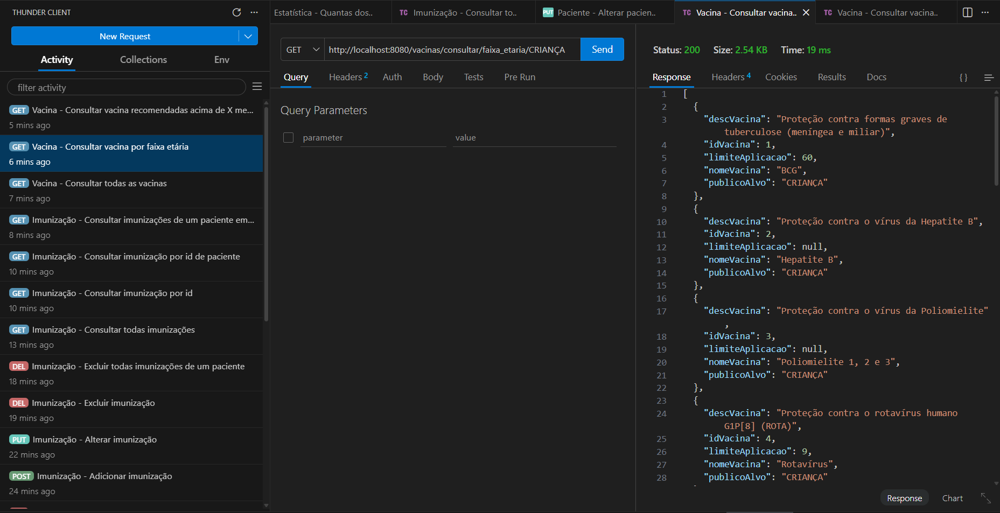

# Gerenciamento de Vacinas - Hackathon 1000DEVs


Projeto desenvolvido como desafio do **Hackathon** do programa **1000DEVs**, uma iniciativa da [mesttra.](https://www.mesttra.com/) em parceria com Johnson & Johnson e Hospital Israelita Albert Einstein.

## 📇 Sumário
- [Sobre o projeto](#-sobre-o-projeto)
- [Funcionalidades](#-funcionalidades)
- [Estrutura do projeto](#️-estrutura-do-projeto)
- [Ferramentas e tecnologias](#-ferramentas-e-tecnologias-utilizadas)
- [O padrão que o projeto segue](#️-o-padrão-que-o-projeto-segue)
- [Como executar o projeto](#-como-executar-o-projeto)
- [Colaboradores](#-colaboradores)
- [Licença](#-licença)

## 📌 Sobre o projeto
O sistema consiste em uma API RESTful desenvolvida para permitir o gerenciamento completo de imunizações de uma família. A solução foca na organização do histórico vacinal e no acompanhamento do calendário recomendado por idade (em meses), garantindo que cada integrante tenha o controle preciso de suas doses aplicadas e pendentes.

🔗 [Obtenha acesso completo ao escopo do projeto](https://drive.google.com/drive/folders/1gNaYRaenOnGALls2SIJYTpuq5KUuhlQX)

## 📸 Demonstração da API
<p align="center">
  
  <br>
  <em>Exemplo de resposta da API para consulta de vacinas por faixa etária.</em>
</p>

## ✨ Funcionalidades
As funcionalidades são acessadas via APIs RESTful, incluindo:

* **Gestão de Pacientes**: Cadastro, alteração, exclusão e consulta de integrantes da família.
* **Controle de Imunizações**: Registro detalhado de vacinas aplicadas, incluindo fabricante, lote e local de aplicação.
* **Calendário Vacinal**: Consulta de vacinas recomendadas por idade (meses) e faixa etária (Criança, Adolescente, Adulto, Gestante).
* **Módulo de Estatísticas**: Endpoints para cálculo de vacinas aplicadas, vacinas atrasadas com base na idade do paciente e previsões para o próximo mês.

## 🗂️ Estrutura do projeto
<details>
    <summary><strong>👉🏼🚨 Clique para acessar o Conteúdo Técnico completo</strong></summary>

    ├── 📁 assets                      # Identidade visual e exemplos de cards
    ├── 📁 src/main/java/br/com/projeto_hackathon_api_vacinacao_paciente
    │   ├── 📁 controller              # Endpoints REST: Gerenciam as rotas de Paciente, Vacina, Imunização e Estatísticas
    │   ├── 📁 dto                     # Data Transfer Objects: Formatação de entrada e saída de dados da API
    │   ├── 📁 model                   # Entidades (JPA): Mapeamento das tabelas Paciente, Vacina, Dose e Imunizacao
    │   ├── 📁 repository              # Interfaces (JPA): Repositórios para persistência de dados no MySQL
    │   ├── 📁 service                 # Lógica de Negócio: Cálculos de calendários, atrasos e regras vacinais
    │   └── ☕ Application             # Classe principal que inicia o Spring Boot
    ├── 📁 src/main/resources
    │   └── 📄 application.properties  # Configurações de conexão com o banco de dados e Hibernate
    ├── 📄 LICENSE                     # Licença MIT do projeto
    └── 📄 pom.xml                     # Gerenciador de dependências Maven (Spring Starter, MySQL, JPA)
    
</details>

## 🔧💻 Ferramentas e tecnologias utilizadas
* **Linguagem:** Java 17
* **Framework:** Spring Boot (Spring Data JPA, Spring Web)
* **ORM:** Hibernate (Gerenciamento de persistência)
* **Banco de Dados:** MySQL
* **Testes de API:** Thunder Client
* **Gestão do Projeto:** Trello

## ⌨️ O padrão que o projeto segue
Pense nas camadas como uma linha de montagem:

```
Requisição HTTP → Controller → Service → Repository → Banco de Dados
```

* **Model:** Representa a entidade do banco de dados (ex: Paciente, Vacina) e suas regras de estrutura.
* **Repository:** Interface que utiliza **Spring Data JPA** para realizar operações no banco de dados (CRUD).
* **Service:** Camada intermediária que contém a lógica de negócio (ex: cálculo de vacinas atrasadas).
* **Controller:** Gerencia as rotas de entrada (Endpoints) e as respostas HTTP (JSON).
* **DTO (Data Transfer Object):** Utilizado para filtrar e formatar os dados que entram e saem da API, garantindo segurança e performance.

## 🚀 Como executar o projeto

### Pré-requisitos
* Java 17 ou superior instalado.
* MySQL instalado e rodando.
* Maven (opcional, pois o projeto inclui o `mvnw`).

### Passo a passo
1. **Clonar o repositório:**
```bash
git clone https://github.com/TheGabrielVieira/projeto_hackathon_api_vacinacao_paciente.git
```

2. **Configurar o banco de dados:**
* Crie um banco chamado vacinacao no seu MySQL.
* Ajuste as credenciais (usuário e senha) no arquivo `src/main/resources/application.properties`.
    * ⚠️ **Nota Técnica**: A aplicação espera que o **MySQL** esteja rodando na porta padrão ``3306``. Caso o seu banco use uma porta diferente, atualize a URL de conexão no arquivo de propriedades.
* As tabelas serão criadas automaticamente pelo **Hibernate** (*ddl-auto: update*) assim que a aplicação for iniciada.

3. **Executar a aplicação:**
```Bash
./mvnw spring-boot:run
```

4. **Testar os Endpoints:**
* A API estará disponível em ``http://localhost:8080``.
* Você pode importar os arquivos de teste no **Thunder Client** ou **Postman**.

<!-- ## 🧠 Lógica de Negócio em Destaque: Vacinas Atrasadas
Um dos maiores desafios técnicos deste projeto foi o cálculo inteligente de vacinas em atraso. A lógica implementada no `EstatisticaService` segue os seguintes critérios:

1. **Cálculo Cronológico:** O sistema converte a idade do paciente para meses totais.
2. **Cruzamento de Dados:** Filtramos todas as doses cuja `idade_recomendada` já passou, mas que ainda não possuem um registro correspondente na tabela de `imunizações` para aquele paciente.
3. **Validação de Eficácia:** Respeitamos o campo `limite_aplicacao`. Se o paciente ultrapassou a idade limite de eficácia da vacina, ela deixa de ser listada como pendente, evitando orientações médicas incorretas. -->

<!-- ## 🚀 Próximos Passos (Roadmap)
Embora o MVP (Produto Mínimo Viável) atenda a todos os requisitos do Hackathon, planejei as seguintes melhorias futuras:
* 🔐 **Segurança:** Implementação de Spring Security com JWT para autenticação de usuários.
* 📖 **Documentação:** Integração com Swagger/OpenAPI para documentação interativa dos endpoints.
* 🐳 **Dockerização:** Criação de um Dockerfile para facilitar o deploy da API e do banco de dados.
* 🧪 **Testes:** Aumento da cobertura de testes unitários e de integração com JUnit 5. -->

## 👥 Colaboradores
| [<br><sub>Anna Julia Pereira</sub>](https://github.com/anaju24k) | [<br><sub>Anne Heráclio</sub>](https://github.com/anneheracliodorego-dev) | [<br><sub>Arthur Alves</sub>](https://github.com/arthuralves0357-star) | [<br><sub>Gabriel Vieira</sub>](https://github.com/TheGabrielVieira) |
| :---: | :---: | :---: | :---: |
| [<br><sub>Geovanni Marques</sub>](https://github.com/GeovanniMarques) | [<br><sub>Heverton Xavier</sub>](https://github.com/hevertonxav) | [<br><sub>João Marco</sub>](https://github.com/MarcolaMTB) | [<br><sub>Rafael Cantari</sub>](https://github.com/Kanth-eri) |

## 📄 Licença
Este projeto está licenciado sob a **Licença MIT**. Veja o arquivo [LICENSE](./LICENSE) para detalhes sobre direitos autorais e permissões.

<br>

---

### 🏆 Realização
Projeto desenvolvido durante o **Hackathon 1000DEVs**.

<br>

*Sinta-se à vontade para usar, modificar e distribuir este código, desde que os créditos sejam mantidos.*